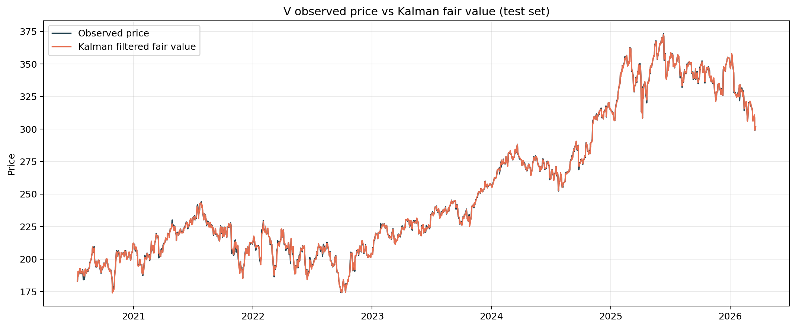

# Kalman-Filtered Statistical Arbitrage

This project studies a trading hypothesis rather than a pure modeling exercise:

> prices and relative-value relationships wander around a latent equilibrium because of noise, liquidity shocks, and short-horizon dislocations; a Kalman state-space model may estimate that equilibrium more cleanly than a static rolling signal, and deviations from it may be tradable via mean reversion.

The central question is not "can I implement a Kalman filter?" It is:

> does a dynamic state-space estimate produce a better tradable signal than a naive rolling z-score once transaction costs, unstable hedge ratios, and post-2020 regime breaks are accounted for?

## Trading Strategy

Baseline:

- fit a static train-set OLS hedge ratio
- construct the residual spread
- trade a rolling z-score mean-reversion signal

Kalman strategy:

- estimate time-varying `alpha_t` and `beta_t` with a Kalman regression
- define fair value as `alpha_t + beta_t x_t`
- define the spread as `y_t - (alpha_t + beta_t x_t)`
- volatility-scale the spread to get the trading signal

Trading rule:

- go long the spread when `z_t < -entry`
- go short the spread when `z_t > entry`
- exit when the signal reverts inside the exit band

This makes the alpha explicit:

```text
signal_t = observed relationship - filtered fair value
```

The repo compares:

1. static hedge ratio + rolling z-score
2. dynamic Kalman state-space regression

## Backtest Setup

- Data: daily close prices from Stooq
- Split: 60% train, 40% test
- Costs: 5 bps per side unless otherwise stated
- Execution: causal next-period PnL on the held spread
- Diagnostics: Engle-Granger, ADF, KPSS, OLS confidence intervals
- Inference: moving-block bootstrap confidence intervals for Sharpe and Sharpe differences

## Main Result

The strongest version of the study is the screened universe, not the `V/MA` case study.

Starting from `16` candidate pairs, the project keeps only pairs with train-set Engle-Granger `p <= 0.10`. That produces `8` evaluated pairs:

- `EWA/EWC`
- `XLI/VIS`
- `EWA/EWS`
- `HD/LOW`
- `TLT/IEF`
- `TMO/DHR`
- `MCD/YUM`
- `KO/PEP`

Out-of-sample summary across those selected pairs:

- Kalman beats the naive model on Sharpe for `5/8` pairs
- Kalman beats the naive model on total return for `6/8` pairs
- Mean pair-level Sharpe improvement: `+0.084`
- Median pair-level Sharpe improvement: `+0.111`

Equal-weight test portfolio:

| Portfolio | Annual Return | Sharpe | Max Drawdown | Total Return |
| --- | ---: | ---: | ---: | ---: |
| Naive | -0.61% | -0.31 | -8.06% | -3.39% |
| Kalman state-space | -0.03% | -0.01 | -3.74% | -0.15% |

Bootstrap uncertainty on the portfolio Sharpe difference:

- 95% CI: `[-0.47, 1.10]`
- Probability that Kalman Sharpe exceeds naive Sharpe: `83.7%`

Interpretation:

- the Kalman model improves the cross-sectional point estimates
- the portfolio still does not produce a strong positive net Sharpe at 5 bps
- the filtered strategy is best described as "more resilient" rather than "profitable"

## The Most Important Finding: Mean Reversion Breaks Down Out of Sample

The most interesting result in the project is not that the Kalman model wins. It is that many train-set relationships stop behaving like stationary spreads after 2020.

In the screened universe:

- only `3/8` pairs reject a unit root in the test set by ADF at the 5% level
- `0/8` pairs avoid KPSS rejection of stationarity at the 5% level

That means the core assumption behind mean-reversion trading weakens materially out of sample, even after train-set screening.

This is the right way to read the project:

- the model is reasonably built
- the testing is real
- the post-2020 market environment is hostile to stable spread relationships

Plausible drivers include post-COVID regime shifts, rate shocks, sector rotation, and changing macro sensitivity across what used to be tighter relative-value relationships. That interpretation is an inference from the diagnostics, not a proven causal claim.

## Transaction Cost Sensitivity

Costs are one of the main reasons the strategy narrative changes from "promising" to "weak."

### Screened Universe Portfolio

| Cost (bps) | Naive Sharpe | Kalman Sharpe |
| --- | ---: | ---: |
| 0 | 0.25 | 0.57 |
| 2 | 0.03 | 0.34 |
| 5 | -0.31 | -0.01 |
| 10 | -0.87 | -0.59 |

This is a much stronger conclusion than a single Sharpe number:

- gross or near-gross results are meaningfully positive
- implementation frictions are what destroy most of the edge
- the Kalman strategy is still consistently better than the naive baseline across the tested cost grid

### Illustrative `V/MA` Pair

| Cost (bps) | Naive Sharpe | Kalman Sharpe |
| --- | ---: | ---: |
| 0 | 0.67 | 1.15 |
| 2 | 0.35 | 0.76 |
| 5 | -0.13 | 0.15 |
| 10 | -0.98 | -0.92 |

On `V/MA`, the Kalman strategy executes `217` test trades versus `207.5` for the naive baseline. The dynamic hedge ratio makes the model more responsive, but that responsiveness also increases turnover and leaves the strategy highly cost-sensitive.

## Why `V/MA` Is Still In The Repo

`V/MA` does **not** pass the train-set cointegration screen:

- train Engle-Granger p-value: `0.346`

So it is not used for the project's main conclusions.

It stays in the repository for a different reason: it is a visually clear, intuitive case study for showing what the model is doing.

For `V/MA`:

- the dynamic hedge ratio visibly drifts through time
- the price-versus-fair-value chart makes the signal easy to understand
- the test-set spread does look more stationary than the train-set spread

That makes it a good illustrative example, but not a statistically strong headline result. The README therefore treats the screened universe as the main evidence and `V/MA` as a worked example.

## Illustrative Case Study: `V/MA`

Study window: `2012-01-03` to `2026-03-20`  
Train end: `2020-07-10`  
Test start: `2020-07-13`

Static train-set spread:

```text
V - (10.24 + 0.6071 * MA)
```

Train diagnostics:

- Engle-Granger p-value: `0.346`
- Train ADF p-value: `0.155`
- Train KPSS p-value: `0.010`
- 95% confidence interval for static beta: `[0.6042, 0.6100]`

Test performance at 5 bps:

| Strategy | Annual Return | Sharpe | Max Drawdown | Total Return | Trades |
| --- | ---: | ---: | ---: | ---: | ---: |
| Static hedge + rolling z-score | -0.68% | -0.13 | -9.54% | -3.82% | 207.5 |
| Kalman state-space regression | 0.48% | 0.15 | -9.48% | 2.78% | 217.0 |

Sharpe uncertainty:

- Naive 95% CI: `[-0.81, 0.62]`
- Kalman 95% CI: `[-0.67, 0.92]`
- Sharpe delta 95% CI: `[-0.54, 0.93]`
- Probability that Kalman Sharpe exceeds naive Sharpe: `70%`

Interpretation:

- the Kalman point estimate is better
- the evidence is far too weak to claim a robust edge from this pair alone
- the dynamic-beta mechanism is clearer than the statistical evidence

## What This Project Shows

- A dynamic hedge ratio is more credible than freezing `beta` once and hoping the relationship stays stable.
- A proper quant project should test the signal against a naive baseline, not just implement the filter.
- Pair selection and out-of-sample stationarity matter more than model elegance.
- The dominant practical issue here is not lack of raw signal, but fragility after costs and regime change.

## Limitations

- The portfolio-level edge is not statistically decisive.
- Most selected spreads weaken or lose stationarity out of sample.
- The model assumes Gaussian observation noise and random-walk state evolution.
- Parameter choice is still train-set tuned and may be regime-sensitive.
- Daily close data is a simplification; real execution could be worse.

## Future Work

- adaptive estimation of state and observation covariance
- walk-forward re-estimation instead of a single split
- portfolio construction beyond equal weighting
- richer pair selection rules using fundamentals or persistence of cointegration
- alternative baselines such as EWMA or AR(1) residual models

## Repo Structure

```text
README.md
data/
notebooks/
results/
scripts/
src/
tests/
```

Key files:

- `scripts/run_research.py`: single-pair study
- `scripts/run_universe_research.py`: screened-universe study
- `src/quant_project/signals.py`: dynamic hedge-ratio estimation and signal construction
- `src/quant_project/backtest.py`: transaction-cost-aware backtest
- `src/quant_project/diagnostics.py`: statistical testing and bootstrap inference

## Reproduce

Single-pair study:

```bash
python3 scripts/run_research.py --asset-a V --asset-b MA --start-date 2012-01-01 --output-dir results/v_ma
```

Universe study:

```bash
python3 scripts/run_universe_research.py --start-date 2012-01-01 --selection-pvalue-threshold 0.1 --output-dir results/universe
```

## Figures




