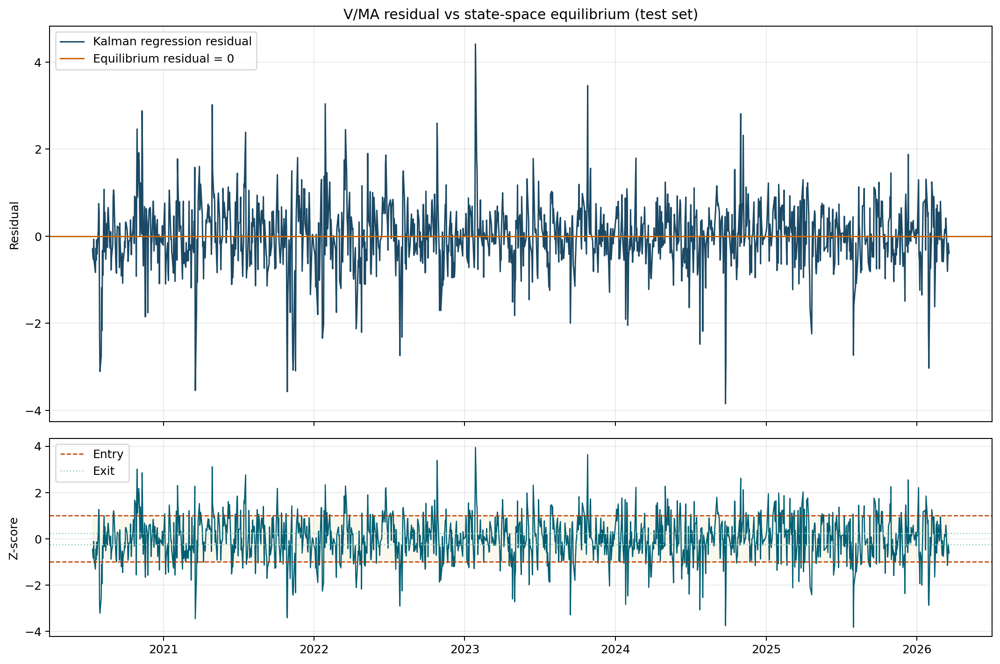
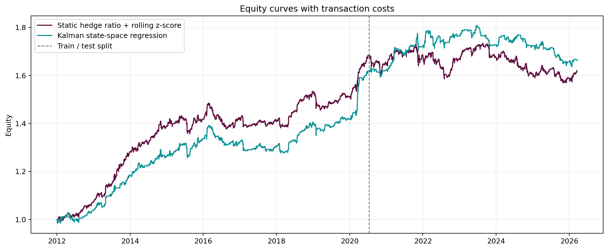
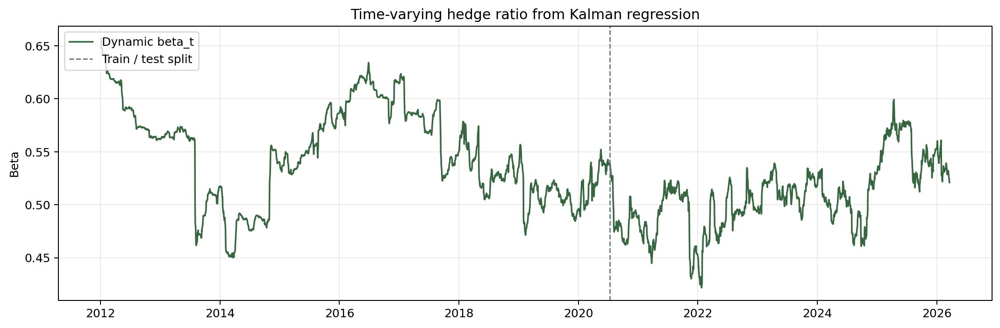
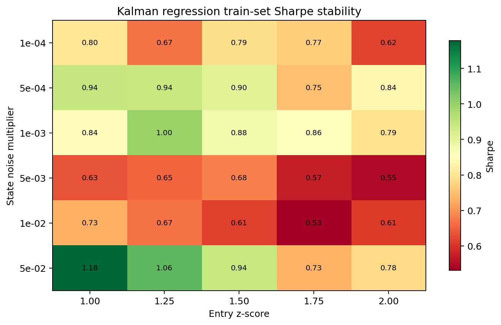
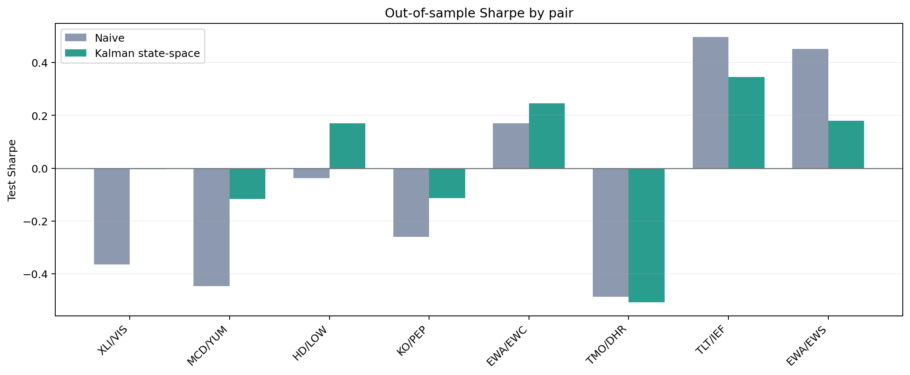
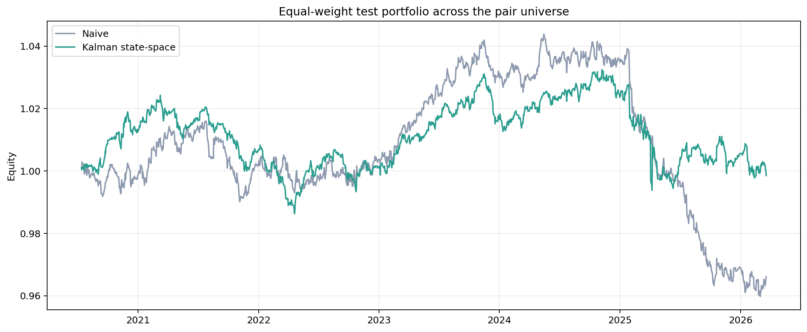

# Signal Extraction and Mean-Reversion Strategies in Noisy Financial Time Series

This repository studies whether a state-space model can improve a simple relative-value strategy once prices are noisy, hedge ratios drift, and regime changes matter. The project compares a static rolling z-score baseline against a Kalman state-space regression that estimates a time-varying intercept and hedge ratio, then evaluates both on a single `V/MA` case study and on a screened universe of economically related pairs.

## Research Question

Can dynamic signal extraction improve a mean-reversion strategy after accounting for:

- train/test separation
- transaction costs
- unstable hedge ratios
- pair selection risk
- uncertainty in out-of-sample Sharpe estimates

## Method

1. Estimate a static baseline spread on the train set using OLS.
2. Build a naive benchmark from a rolling z-score of that spread.
3. Build a state-space alternative using a Kalman regression:
   - observation equation: `y_t = alpha_t + beta_t x_t + epsilon_t`
   - state equation: `[alpha_t, beta_t]` follows a random walk
4. Standardize the residual with an exponentially weighted volatility estimate and trade mean reversion with entry/exit bands.
5. Backtest both strategies with 5 bps per side and causal execution.
6. Report Engle-Granger, ADF, KPSS, OLS confidence intervals, and moving-block bootstrap confidence intervals for Sharpe.
7. Extend beyond one anecdotal pair by screening a broader candidate universe using train-set cointegration only.

## Project Layout

- `src/quant_project/data.py`: market data loader and pair alignment
- `src/quant_project/signals.py`: static OLS hedge ratio, Kalman state-space regression, signal construction
- `src/quant_project/backtest.py`: transaction-cost-aware backtest with time-varying hedge ratios
- `src/quant_project/diagnostics.py`: Engle-Granger, ADF, KPSS, and block-bootstrap inference
- `src/quant_project/research.py`: single-pair study orchestration
- `src/quant_project/universe.py`: candidate-pair screening and cross-sectional aggregation
- `scripts/run_research.py`: reproduce the detailed single-pair study
- `scripts/run_universe_research.py`: reproduce the screened multi-pair study

## Run It

Single-pair case study:

```bash
python3 scripts/run_research.py --asset-a V --asset-b MA --start-date 2012-01-01 --output-dir results/v_ma
```

Screened universe study:

```bash
python3 scripts/run_universe_research.py --start-date 2012-01-01 --selection-pvalue-threshold 0.1 --output-dir results/universe
```

## V/MA Case Study

The detailed case study uses data from `2012-01-03` through `2026-03-20`, with the train set ending on `2020-07-10` and the test set beginning on `2020-07-13`.

Static train-set spread:

```text
V - (10.24 + 0.6071 * MA)
```

Train-set diagnostics are intentionally reported up front because they materially affect interpretation:

- Engle-Granger p-value: `0.346`
- Train spread ADF p-value: `0.155`
- Train spread KPSS p-value: `0.010`
- 95% confidence interval for static beta: `[0.6042, 0.6100]`

This means `V/MA` is a useful case study, but not strong evidence of a stable cointegrated relationship on its own. That is why the project does not stop at this pair.

Out-of-sample comparison on `2020-07-13` through `2026-03-20`:

| Strategy | Test Sharpe | Test Max DD | Test Total Return |
| --- | ---: | ---: | ---: |
| Static hedge + rolling z-score | -0.13 | -9.54% | -3.82% |
| Kalman state-space regression | 0.15 | -9.48% | 2.78% |

Sharpe uncertainty:

- Naive 95% bootstrap CI: `[-0.81, 0.62]`
- Kalman 95% bootstrap CI: `[-0.67, 0.92]`
- Sharpe delta 95% bootstrap CI: `[-0.54, 0.93]`
- Probability that Kalman Sharpe exceeds naive Sharpe: `70%`

Interpretation: the dynamic model improves the point estimate, but the single-pair result is still statistically weak. That is a limitation, not something to hide.

The July 13, 2020 test split lands immediately after the COVID regime shock. The dynamic hedge ratio plot shows the `V/MA` relationship drifting materially through and after that regime, which helps explain why a fixed train-set hedge ratio is fragile.









## Screened Pair Universe

To avoid treating one pair as a conclusion, the project screens a broader candidate universe of `16` related pairs using train-set Engle-Granger p-values only, then keeps pairs with `p <= 0.10`. That rule selected `8` pairs:

- `EWA/EWC`
- `XLI/VIS`
- `EWA/EWS`
- `HD/LOW`
- `TLT/IEF`
- `TMO/DHR`
- `MCD/YUM`
- `KO/PEP`

The full screen is saved in `results/universe/screen_table.csv`, and the evaluated pair results are saved in `results/universe/pair_summary.csv`.

Cross-sectional summary on the test set:

- Kalman beats the naive model on test Sharpe for `5/8` pairs.
- Kalman beats the naive model on total return for `6/8` pairs.
- Mean pair-level Sharpe improvement: `+0.084`
- Median pair-level Sharpe improvement: `+0.111`
- Pairs that remain cointegrated at the 5% level in the full diagnostic pass: `6/8`

Equal-weight test portfolio across the selected pairs:

| Portfolio | Sharpe | Max DD | Total Return |
| --- | ---: | ---: | ---: |
| Naive | -0.31 | -8.06% | -3.39% |
| Kalman state-space | -0.01 | -3.74% | -0.15% |

Portfolio Sharpe-delta uncertainty:

- 95% bootstrap CI: `[-0.47, 1.10]`
- Probability that Kalman Sharpe exceeds naive Sharpe: `83.7%`

Interpretation: the cross-sectional evidence is stronger than the single-pair evidence. The state-space model does not create a high-Sharpe result here, but it does improve median pair performance, materially reduces drawdown, and nearly neutralizes the aggregate test-set loss.





## Conclusions

- A dynamic hedge ratio is a more credible modeling choice than fixing `beta` once and hoping the relationship stays stable.
- Statistical diagnostics matter: `V/MA` alone is not strong enough to support a sweeping claim about robustness.
- A train-set pair screen produces a better-designed universe study than an arbitrary basket of “similar” names.
- The state-space model improves out-of-sample behavior in this project, but the uncertainty bands are still wide enough that the conclusions should remain modest.
